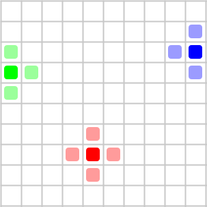
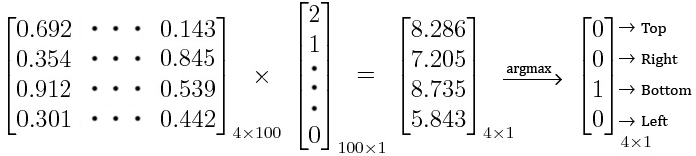
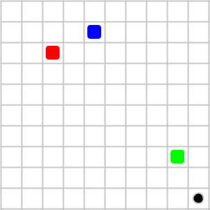
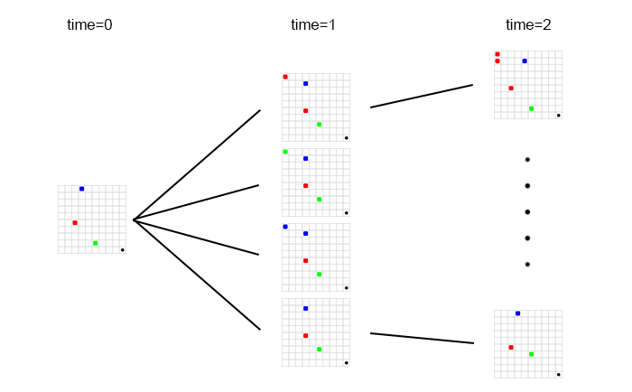

# Through Time

A simulator that aims to simulate a world based on [Dark's](https://www.netflix.com/title/80100172) concept of time travel.

## Premises and constraints

For the sake of simplicity, let us consider a finite two-dimensional space where the time and space are quantised. That is, the world is a two-dimensional grid, where beings can move only along the grid. Let us also consider that an being is of the size of a grid (a being cannot span over two grids). For each step in time, a being can either stay in place, or move in one of the available directions. Also, two beings cannot overlap.

 Each being in the grid can move to one of the shown possible positions in the next time step

### Qualities of beings

Each being gets a set of inputs and performs actions based on those inputs. Generally the input would be some representation of the entire state of the world. For example, the input could be a 100 element array of numbers, one element for each grid where 0 is for empty, 1 for green, 2 for blue etc.

 The 4 x 100 matrix is the brain of the being.

As shown above, the input vector is multiplied by a matrix inherent to the being. This results in a smaller dimensional vector based on which the decision is made.
Now, this is just one way of decision making. The important point to note is that at any time, states of all the beings are visible to each of the beings.
 
 
Each being has a fixed life time after which it will cease to exist.

### The time portal

There is a specific location in the world if reached by beings, enables them to travel through time.

 A black hole at the end of the world.

Whenever a being lands on the black hole, it has two more choices. It can travel to the past by 10 steps *(variable)* or to the future by 10 steps. Again, all these decisions can be exactly predicted given the decision mechanism. We also prohibit travel beyond the origin to negative time.

#### Time travel mechanics

Whenever someone travels to the future for 10 frames, the being dissapears on the next time step and reappears after 10 time steps with the same age.
 
 
Whenever someone travels to the past for 10 frames, their presence is mandatory in the (n - 10)th frame. That is, in the (n - 10)th frame, there are two beings who are the same, but one, 10 frames older than the other. The future causes the present.

#### Destination post travel

In order to avoid ambiguities regarding the physical destination, after travel, the being ends up at the top left corner of the world. If the position is occupied, they are placed one block to the right and so on. 

## Aim

Our aim is to simulate this 10x10 world for a given initial configuration for a given amount of time steps. The concept of time travel introduces a lot of degrees of freedom. There are a lot of solutions for a given initial configuration. We should be abled to simulate at least one of them if not all. Remember, the brains of the beings are unaltered at any given time and each decision can be accutarely predicted given the current state of the world.

Please feel free to post issues for suggestions / for a better understanding of the concept.

## Proposed method

The proposed method is to construct a tree of possible next moves considering the possibility of time travel in the future. That is, for each frame, we also consider that someone, 10 frames to the future, travels to the past. To resolve this, we first move beings according to their will as normal. We then place 3 more parallel frames *(3 in this case because we have 3 individuals)* on the same step where each frame has an additional one of the three beings on the top left. This additional being is 10 frames older than the respective normal-time being.

 A state branching to possible states in the next time step.

After the 10th frame, we start looking at the portal, checking if someone travels through it. For example, for all of the possible frames in the 15th time step, if there is no case where blue reaches the portal, we immediately discard the frame in the 5th time step where we accounted for blue's travel to the past. We also discard all of it's child frames.

> **Note**: All the numbers in the above examples are variables and can be anything for a given world. 10 frames could instead be 33 frames :wink:
