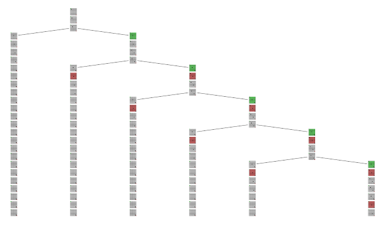
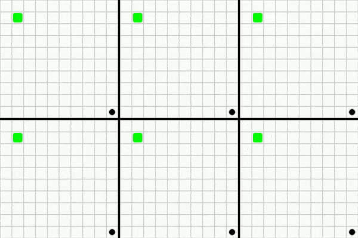

# Tree simulator

The tree simulator produces valid non-paradoxical solutions (if any exists) for the provided combinantion of actor characteristics, initial state and time travel rules.

## Brief overview

The simulator produces a "tree" where each node represents a state of the world and the children of the node are the possible states that result from the branching of the timeline due to time travel. The tree will be expanded level by level until the simulation timespan is reached. Each new node formed, when subjected to the laws of the environment, may confirm/disprove the existence of an ancestor node thus pruning the tree from forming paradoxical paths. Each path from the root of the final tree to the leaves represents a valid non-paradoxical solution.

## Example

The following example demonstrates the simulation of a tree for a simple scenario where one actor is present in the world.

The world is a $10\times10$ grid with the portal present at the bottom right corner. An actor can travel 5 units to the past when it reaches the portal.

The actor is defined by the following characteristics:

- The actor moves diagonally to the bottom right edge of the world.
- When a future copy of the actor is present in the world, the actor will be motivated to travel to the past.
- The actor will not travel to the past if there is no future copy of the actor present in the world.

The above rules when simulated for 25 frames, lead to six unique timelines as illustrated below:

 <b>Timeline tree:</b><i> Branching occurs when travel conditions are met. Red highlight denotes an actor entering the portal. Green highlight denotes an actor leaving the portal and entering the world.</i>

 <i>All six timelines simulated frame by frame. A character appearing at the top left corner is always followed by a character entering the portal 5 units of time later.</i>

